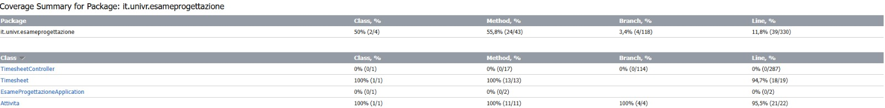
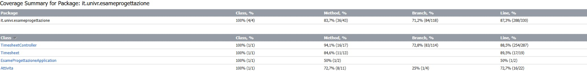

# Gestore dei timesheet dei ricercatori

Progetto a cura di:
- Mattia Bernardi (VR502842)
- Elisa Biasi (VR525865)
- Ilaria Meghi (VR516348)

---

## Introduzione
La componente software è stata sviluppata con lo scopo di migliorare le attività di creazione, compilazione e gestione dei timesheet dei ricercatori universitari. 
Il nostro team si è concentrato sulla progettazione e creazione della pagina personale di un ricercatore, includendo inoltre diverse funzionalità utili. 
Il sistema mette a disposizione svariati strumenti per l'analisi e la ricerca che facilitano l'interazione e l'esperienza utente.

---

## Scaricare il progetto
Se si desidera scaricare il progetto è necessario clonare la repository digitando sul terminale il comando **git clone https://github.com/Illy13/EsameTimesheetProject_final.git**. Per scaricare le dipendenze necessarie al corretto funzionamento del sistema e compilare il progetto è necessario eseguire il comando **./gradlew build**.
Infine per eseguire il progetto sarà sufficiente lanciare **./gradlew bootRun** e la piattaforma sarà visibile alla pagina **localhost:8080**.

---

## Descrizione dei requisiti 
Il sistema deve essere in grado di:
- Creare nuovi timesheet.
- Modificare timesheet esistenti.
- Visualizzare timesheet esistenti.
- Eliminare timesheet.
- Mandare la richiesta di approvazione del timesheet al responsabile scientifico.
- Confrontare timesheet diversi.
- Ricercare timesheet in base al nome del progetto.
- Ordinare i diversi timesheet in base al nome del progetto. Ordinare le attività di un progetto in base alle ore lavorate.
- Scaricare il timesheet del progetto come file excel
  
**Note**:
- La richiesta di approvazione è chiaramente simulata in quanto non è stata sviluppata la componente software per le attività del responsabile scientifico.
- Si parte dal presupposto che l'utente sia autenticato e all'interno della sua area personale.

---

## Scenari di utilizzo

**Nota:**

- I vincoli di sistema sono tutti quei controlli che il software effettua sull'inserimento delle ore. In particolare:
  - Il numero totale di ore lavorative in una giornata, ovvero la somma delle ore delle attività di un progetto in una certa data, deve essere al massimo 8. Questo vincolo viene controllato durante l'inserimento di ore in un timesheet già esistente (nelle pagine edit e addActivity).
  - Nella pagina di creazione il numero di ore inserito per la prima attività deve essere compreso tra 1 e 8 estremi inclusi.
  - Nella pagina di modifica il numero di ore inserito deve essere compreso tra 0 e 8 estremi inclusi.
  - Non possono essere inserite ore di lavoro nei giorni festivi. 

### Scenario 1: Creare un nuovo timesheet
- **Assunzioni iniziali**: 
  L'utente desidera creare un nuovo timesheet tramite il sistema software. 
- **Utilizzo normale del sistema**:
  1. L'utente accede alla pagina principale, dove può osservare la lista completa dei timesheet esistenti (può essere inizialmente vuota) e i diversi strumenti di ricerca.
  2. L'utente a questo punto deve cliccare sul link 'Aggiungi nuovo timesheet'
  3. L'utente viene reindirizzato alla pagina di creazione.
  4. L'utente può ora compilare il form per creare il timesheet desiderato, una volta soddisfatto deve premere 'Salva Timesheet'.
  5. Il timesheet viene dunque creato e visualizzato nella pagina principale con a fianco il menu delle azioni.
- **Cosa può andare storto**:
   - Il sistema deve essere in grado di gestire situazioni in cui alcuni dei dati inseriti non soddisfano i vincoli di sistema; 
     in tal caso, il sistema deve notificare all'utente l'errore specificando per quale motivo l'operazione non è andata a buon fine.
- **Altre attività**:
   - Quando viene premuto 'Salva Timesheet' il sistema salva nel database il nuovo timesheet.
   - L’utente può decidere se salvare i dati o tornare alla pagina principale, in quest'ultimo caso i dati inseriti verranno persi.
- **Stato del sistema a fine utilizzo**:
  - Il sistema mostra all’utente la lista dei timesheet e rende disponibile un menu con le diverse azioni che possono essere svolte su ogni istanza; il sistema rimane in uno stato pronto per accogliere nuove   
    richieste.
 
### Scenario 2: Modificare timesheet esistenti.
**Assunzioni iniziali**: 
  L'utente desidera modificare un timesheet esistente tramite il sistema software.

- L'utente vuole aggiungere un'attività al timesheet.  
  - **Utilizzo normale del sistema**:
  1. L'utente accede alla pagina principale, dove può osservare la lista completa dei timesheet esistenti.
  2. L'utente trova nella lista il timesheet che vuole aggiornare e preme il pulsante '+ Attività'
  3. L'utente viene reindirizzato alla pagina di aggiunta dell'attività.
  4. L'utente può ora compilare il form indicando l'attività svolta, le ore lavorate e la data in cui è stata svolta l'attività, una volta soddisfatto deve premere 'Salva Attività'.
  5. Il timesheet viene aggiornato.
  - **Cosa può andare storto**:
     - Il sistema deve essere in grado di gestire situazioni in cui alcuni dei dati inseriti non soddisfano i vincoli di sistema; 
       in tal caso, il sistema deve notificare all'utente l'errore specificando per quale motivo l'operazione non è andata a buon fine.
  - **Altre attività**:
     - Quando viene premuto 'Salva Attività' il sistema salva nel database l'aggiornamento apportato
     - L’utente può decidere se salvare i dati o tornare alla pagina principale, in quest'ultimo caso i dati inseriti verranno persi.
  - **Stato del sistema a fine utilizzo**:
     - Il sistema mostra all’utente la lista dei timesheet e rende disponibile un menu con le diverse azioni che possono essere svolte su ogni istanza; il sistema rimane in uno stato pronto per accogliere nuove richieste.

- L'utente vuole cambiare il numero di ore indicate attualmente nel timesheet per un'attività già inserita.
  - **Utilizzo normale del sistema**:
  1. L'utente accede alla pagina principale, dove può osservare la lista completa dei timesheet esistenti.
  2. L'utente trova nella lista il timesheet che vuole modificare e preme il pulsante 'Modifica'
  3. L'utente viene reindirizzato alla pagina di modifica.
  4. L'utente cerca nella tabella la riga corrispondente alla data e all'attività che desidera modificare e cambia il numero di ore inserito.
  5. L'utente una volta soddisfatto preme 'Salva Modifiche'.
  6. Il timesheet viene modificato.
  - **Cosa può andare storto**:
     - Il sistema deve essere in grado di gestire situazioni in cui alcuni dei dati inseriti non soddisfano i vincoli di sistema; 
       in tal caso, il sistema deve notificare all'utente l'errore specificando per quale motivo l'operazione non è andata a buon fine.
  - **Altre attività**:
     - Quando viene premuto 'Salva Modifiche' il sistema salva nel database le modifiche apportate
     - L’utente può decidere se salvare i dati o tornare alla pagina principale, in quest'ultimo caso i dati inseriti verranno persi.
  - **Stato del sistema a fine utilizzo**:
     - Il sistema mostra all’utente la lista dei timesheet e rende disponibile un menu con le diverse azioni che possono essere svolte su ogni istanza; il sistema rimane in uno stato pronto per accogliere nuove 
       richieste.
     
### Scenario 3: Visualizzare timesheet esistenti
- **Assunzioni iniziali**: 
  L'utente desidera visualizzare un timesheet esistente tramite il sistema software.
- **Utilizzo normale del sistema**:
  1. L'utente accede alla pagina principale, dove può osservare la lista completa dei timesheet esistenti.
  2. L'utente trova nella lista il timesheet che vuole visualizzare e preme il pulsante 'Mostra'
  3. L'utente viene reindirizzato alla pagina dove può vedere il timesheet completo del progetto selezionato.
- **Cosa può andare storto**:
   - Il sistema deve essere in grado di gestire la situazione in cui l'utente voglia visualizzare un timesheet caricato in modo errato (ci sono stati problemi nella creazione o nella modifica); 
     il sistema deve impedire all'utente di interagire con tali timesheet.
- **Stato del sistema a fine utilizzo**:
   - Il sistema mostra all’utente il timesheet del progetto e rende disponibili diverse funzionalità; il sistema rimane in uno stato pronto per accogliere nuove richieste:
     - Tornare alla pagina principale
     - Ordinare in modo crescente le attività svolte, in base al numero di ore lavorate 
     - Scaricare il timesheet 

### Scenario 4: Eliminare timesheet.
- **Assunzioni iniziali**: 
  L'utente desidera eliminare un timesheet esistente tramite il sistema software.
- **Utilizzo normale del sistema**:
  1. L'utente accede alla pagina principale, dove può osservare la lista completa dei timesheet esistenti.
  2. L'utente trova nella lista il timesheet che vuole eliminare e preme il pulsante 'Elimina'
  3. Il sistema chiede conferma all'utente se vuole eliminare il timesheet selezionato.
  4. L'utente conferma di voler eliminare il timesheet selezionato.
  5. Il timesheet viene eliminato
- **Cosa può andare storto**:
   - Il sistema deve essere in grado di gestire la situazione in cui l'utente non voglia più eliminare il timesheet selezionato; 
     il sistema deve chiedere dunque conferma all'utente prima di eliminare il timesheet.
- **Stato del sistema a fine utilizzo**:
   - Il sistema mostra all’utente la lista dei timesheet aggiornata e rende disponibile un menu con le diverse azioni che possono essere svolte su ogni istanza; il sistema rimane in uno stato pronto per 
     accogliere nuove richieste.
     
### Scenario 5: Richiedere approvazione del timesheet.
- **Assunzioni iniziali**: 
  L'utente desidera richiedere l'approvazione del timesheet al proprio responsabile scientifico tramite il sistema software.  
- **Utilizzo normale del sistema**:
  1. L'utente accede alla pagina principale, dove può osservare la lista completa dei timesheet esistenti.
  2. L'utente trova nella lista il timesheet desiderato e preme il pulsante 'Richiedi Approvazione'
  3. L'utente viene reindirizzato alla pagina per la richiesta dell'approvazione dove può controllare l'intero timesheet.
  4. L'utente preme 'RICHIEDI APPROVAZIONE'.
  5. Il sistema avvisa l'utente che la domanda è stata inviata con successo e rimuove il pulsante 'RICHIEDI APPROVAZIONE'.
  6. L'utente torna alla pagina principale premendo 'Torna alla lista'.
- **Cosa può andare storto**:
   - Il sistema deve essere in grado di gestire la situazione in cui l'utente non voglia più richiedere l'approvazione per il timesheet selezionato; 
     il sistema deve fornire all'utente il modo per tornare alla pagina principale senza mandare la richiesta.
- **Altre attività**:
   - L’utente una volta raggiunta la pagina per la richiesta dell'approvazione può decidere se effettuare la richiesta o tornare alla pagina principale.
- **Stato del sistema a fine utilizzo**:
   - Il sistema mostra all’utente la lista dei timesheet e rende disponibile un menu con le diverse azioni che possono essere svolte su ogni istanza; il sistema rimane in uno stato pronto per accogliere nuove 
     richieste.
       
### Scenario 6: Confrontare timesheet diversi.
- **Assunzioni iniziali**: 
  L'utente desidera confrontare timesheet diversi tramite il sistema software.
- **Utilizzo normale del sistema**:
  1. L'utente accede alla pagina principale, dove può osservare la lista completa dei timesheet esistenti e il form 'Confronta Timesheet'.
  2. L'utente compila il form 'Confronta Timesheet' andando a selezionare i due timesheet da confrontare.
  3. L'utente preme poi il bottone 'Confronta'.
  4. Il sistema ridireziona l'utente alla pagina dove viene mostrato il risultato del confronto tra i due timesheet selezionati.
  5. L’utente torna alla pagina principale.
- **Cosa può andare storto**:
   - Il sistema deve essere in grado di gestire situazioni in cui non siano presenti progetti nel database (non è possibile selezionare alcun progetto) o venga premuto il bottone 'Confronta' senza aver inserito un input; 
     il sistema deve mandare un messaggio di errore all'utente.
- **Stato del sistema a fine utilizzo**:
   - Il sistema mostra all’utente la lista dei timesheet e rende disponibile un menu con le diverse azioni che possono essere svolte su ogni istanza; il sistema rimane in uno stato pronto per accogliere nuove 
     richieste.

### Scenario 7: Ricercare timesheet in base al nome del progetto.
- **Assunzioni iniziali**: 
  L'utente desidera ricercare timesheet in base al nome del progetto tramite il sistema software.
- **Utilizzo normale del sistema**:
  1. L'utente accede alla pagina principale, dove può osservare la lista completa dei timesheet esistenti e la barra di ricerca.
  2. L'utente digita nella barra di ricerca il nome del progetto che desidera trovare e preme il bottone 'Cerca'.
  3. Il sistema a questo punto mostra solamente le righe della lista in cui il nome del progetto corrisponde a quello cercato.
- **Cosa può andare storto**:
   - Il sistema deve essere in grado di gestire situazioni in cui il nome inserito non sia presente nel database o venga premuto il bottone 'Cerca' senza aver inserito un input; 
     nel primo caso il sistema deve mostrare la lista vuota, nel secondo deve mostrare la lista con tutti i progetti presenti.
- **Stato del sistema a fine utilizzo**:
   - Il sistema mostra all’utente la lista dei timesheet e rende disponibile un menu con le diverse azioni che possono essere svolte su ogni istanza; il sistema rimane in uno stato pronto per accogliere nuove 
     richieste.

### Scenario 8: Ordinamento
- **8.1 Ordinare i diversi timesheet in base al nome del progetto**. 
  - **Assunzioni iniziali**: 
    L'utente desidera ordinare i diversi timesheet in base al nome del progetto tramite il sistema software.
  - **Utilizzo normale del sistema**:
  1. L'utente accede alla pagina principale, dove può osservare la lista completa dei timesheet esistenti e il pulsante 'Ordina per progetto'.
  2. L'utente preme il pulsante 'Ordina per progetto'.
  3. Il sistema a questo punto mostra la lista dei progetti in ordine alfabetico.
  - **Cosa può andare storto**:
     - La lista dopo l'ordinamento potrebbe perdere tutte le sue funzionalità; il sistema deve impedire che ciò accada.
  - **Stato del sistema a fine utilizzo**:
     - Il sistema mostra all’utente la lista dei timesheet ordinati in base al nome del progetto e rende disponibile un menu con le diverse azioni che possono essere svolte su ogni istanza; il sistema rimane in 
       uno stato pronto per accogliere nuove richieste.
 
- **8.2 Ordinare le attività di un progetto in base alle ore lavorate**.
  -  **Assunzioni iniziali**: 
    L'utente desidera ordinare le attività di un progetto in base alle ore lavorate tramite il sistema software.
  - **Utilizzo normale del sistema**:
  1. L'utente accede nella pagina per la visualizzazione
        - L'utente accede alla pagina principale, dove può osservare la lista completa dei timesheet esistenti.
        - L'utente trova nella lista il timesheet desiderato e preme il pulsante 'Mostra'
        - L'utente viene reindirizzato alla pagina dove viene mostrato il timesheet completo del progetto selezionato.
  2. L'utente preme il pulsante 'Ordina per ore'.
  3. Il sistema a questo punto mostra la lista dei progetti ordinata in ordine crescente in base alle ore lavorate.
   - **Cosa può andare storto**:
     - La lista dopo l'ordinamento potrebbe perdere tutte le sue funzionalità; il sistema deve impedire che ciò accada.
  - **Stato del sistema a fine utilizzo**:
    - Il sistema mostra all’utente il timesheet del progetto e rende disponibili diverse funzionalità; il sistema rimane in uno stato pronto per accogliere nuove richieste:
       - Tornare alla pagina principale
       - Ordinare in modo crescente le attività svolte, in base al numero di ore lavorate 
       - Scaricare il timesheet 

### Scenario 9: Scaricare il timesheet del progetto come file excel 
- **Assunzioni iniziali**: 
  L'utente desidera scaricare il timesheet del progetto come file excel tramite il sistema software.
- **Utilizzo normale del sistema**:
  1. L'utente accede nella pagina per la visualizzazione
        - L'utente accede alla pagina principale, dove può osservare la lista completa dei timesheet esistenti.
        - L'utente trova nella lista il timesheet desiderato e preme il pulsante 'Mostra'
        - L'utente viene reindirizzato alla pagina dove viene mostrato il timesheet completo del progetto selezionato.
  2. L'utente preme il pulsante 'Scarica'.
  3. Il sistema scarica il timesheet del progetto come file excel.
- **Cosa può andare storto**:
  - La directory dei download non è impostata su: /User/Utente/Downloads; il sistema evita di scaricare il file per evitare problemi.  
- **Stato del sistema a fine utilizzo**:
  - Il sistema mostra all’utente il timesheet del progetto e rende disponibili diverse funzionalità; il sistema rimane in uno stato pronto per accogliere nuove richieste:
     - Tornare alla pagina principale
     - Ordinare in modo crescente le attività svolte, in base al numero di ore lavorate 
     - Scaricare il timesheet 
  
---

## Test
Il sistema è stato testato in modo approfondito per verificarne il corretto funzionamento, in particolare sono stati condotti test di unità (unit test) e test di accettazione (acceptance test). Per realizzare i test sono stati utilizzati JUnit e Selenium.

Gli acceptance test sono stati pensati per essere svolti in un ordine ben preciso (denotato dai nomi dei test stessi) questo è stato fatto per simulare il normale utilizzo del sistema da parte di un utente generico, andando a ricreare specifiche sequenze di azioni e richieste. 

**Nota:**
- Per un corretto funzionamento dei test questi devono essere eseguiti in ordine e in modo atomico, in quanto tengono conto l'uno dell'altro.

### Coverage
Grazie ai test implementati la coverage raggiunta è:
- per gli unit test:

   
  
- per gli acceptance test:
  
  
